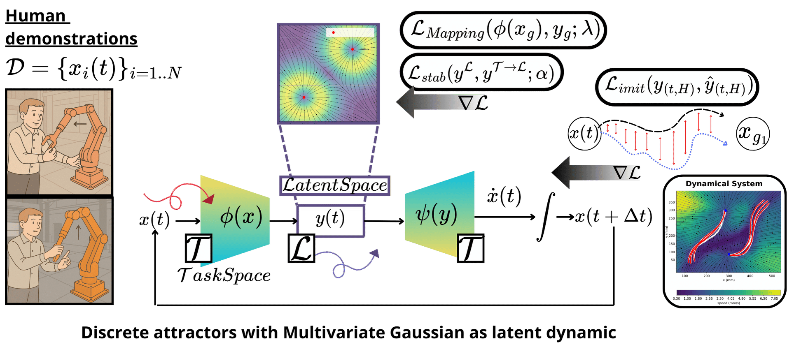
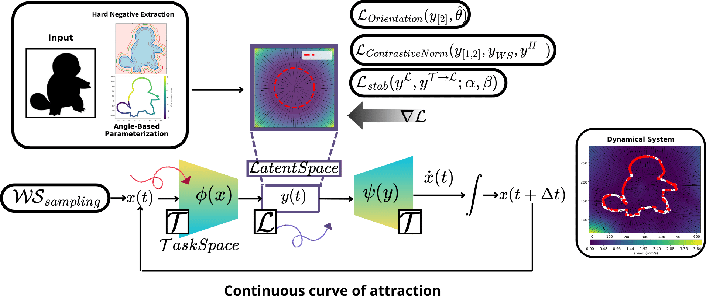

# Learning MultiStable Motion Primitives from Demonstrations via Multi-Attractor Dynamics

### How to address multiple demonstrations with a single model? how enforce stability?
In this project, we explore the integration of multi-attractor dynamics in the latent state of a neural models. 
Once that the operator shown to the robot how to execute a specific set of demonstrations, the system will learn how to reach the target despite the starting configuration. 
The possibility of encode different motion into the model memory enanche the flexibility of the model, shaping the vector field that underline our planner desired state. 

### How can we generalize the attraction point of an object? What can be done for setting the entire contour of an object as a target attractor point?

